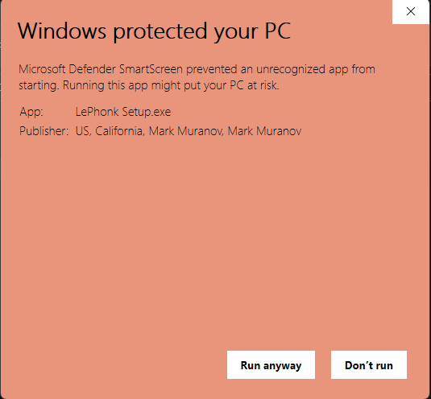
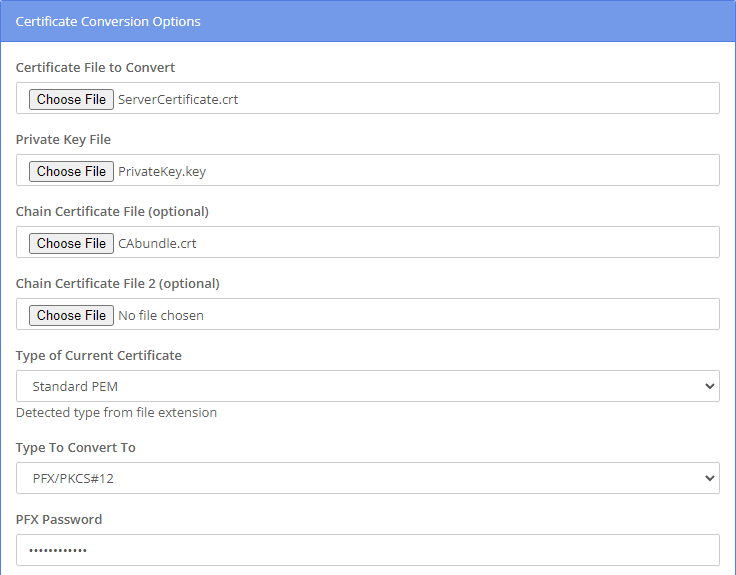

# How to sign apps on Windows

Do you want to create an executable on Windows, but Windows throws a crying fit everytime your friends try to run it? Well, it sounds like you need to sign and notarize your application!

## Step 1 - Buying a certificate

Before being able to sign and notarize, it is important to obtain a code-signing certificate. Unfortunately for you, Microsoft does NOT sell them directly (unlike Apple), so you have to buy a certificate from a 3rd-party vendor.

When Googling for certificates, there are many options which may seem sketchy or expensive (or both). After weighing all the option, we have found that Comodo seems to be the best bang for your buck as it is both cheap and trusted.

On a side-note, it seems as though a lot of the certificate sellers just resell certificates from other sellers, which is why they can seem so expensive.

We settled on buying our certificates from Comodo, which cost about $50-70/year (cheaper than Apple's!). You can buy the certificates here: https://www.ssl2buy.com/comodo-code-signing-certificate.php

You might notice that there is a more expensive option, at about $200-300/year. This option comes with one large benifit: instant Windows SmartScreen reputation, meaning that users will not see this when running your app:

<br/>



<br/>

But even with the cheaper option, once enough users download and use your app, this screen will also stop appearing.

Once you have made the purchase, you will be directed to ss2buy.com. This is the site where you can see and manage your certificate. On your dashboard, on the top-right, you may see a notification asking you to "Complete ssl configuration process for order# 2815168". Be sure to view that notification and complete the steps.

These steps will ask you to fill in personal information and to generate a key. **Be sure to save the private key, as you will NOT be able to get it later!** Also, you may be please to know that your detailed address will NOT show on the actual signed app, only your general location (ex: San Diego, CA, US -- NOT the exact streat address).

Once that is complete, you will likely be asked to take a picture of your ID and a selfie of you holding it. If you are unsure of what to do, be sure to ask the support in the "live chat" window on ssl2buy.com, they are VERY helpful.

Finally, you will soon be verified and your certificate will be active! But don't celebrate yet, there is still a lot of convoluted things you have to do next.

## Step 2 - Creating the `.pfx` file

In order to be able to use Windows signtool, you have to have a `.pfx` file on hand. But wait, you never got one? Well too bad. We will have to make one ourselves.

This will require a few steps:
1. In ssl2buy.com, view your orders. Click on the order number (it should act as a link). On the right, hit the blue, "MANAGE SSL" button. You should be redirected to Comodo's site. Enter the CAPTCHA-thing. On the left, click the "Get Certificate" tab. From there, you should see a bunch of text-boxes with a bunch of randomly generated characters.
2. Using notepad, creating a file named `ServerCertificate.crt` (the `.crt`) extension is important). Edit it like a normal `.txt` file. Going back to the Comodo site from step 1, copy the text in the "Server Certificate" box and paste it into the newly created `ServerCertificate.crt` file. Save and close.
3. Similarly, create a `CAbundle.crt` file. This time, copy & paste the contents of the "Intermediate Certificate2" textbox, then right below that paste the contents of "Intermediate Certificate1", then right below that paste the contents of "Root Certificate". Save and close.
4. Remember your private key that you downloaded? Simply rename that file to `PrivateKey.key`.
5. Lastly, navigate to https://www.sslshopper.com/ssl-converter.html. For the 3rd drop-down, select `PFX/PKCS#12`. You should now see 4 places to upload files. For the top one labeled "Certificate File to Convert", upload `ServerCertificate.crt`. For the next one labeled "Private Key File", upload `PrivateKey.key`. For the 3rd one labeled "Chain Certificate File (optional)", upload `CAbundle.crt`. Leave the 4th one with no file. Lastly, create a password in the "PFX Password" textbox and be sure to save/remember it, as we will be using it later.
6. Hit "Convert Certificate" at the bottom and you're done, you know have a `.pfx` file!

<br/>



<br/>

## Actually signing the application

Finally, we can *at last* sign the stupid app.

Make sure you have the Windows signtool installer. If you don't, I believe it comes with the Windows SDK.

Open the file browser and navigate to `C:\Program Files (x86)\Windows Kits\10\bin` (replace the `10` with `11` on Windows 11). There should be some folders with a bunch of numbers, for example: `10.0.19041.0`. Open the one with the largest numbers lol. Then open the `x64` folder. In here, you should have `signtool.exe`. Keep this folder open, we will need it for later.

Now using Visual Studio Code, create a `signscript.bat` file. Paste this script inside:

```batch
"LOCATION OF SIGNTOOL" sign /f "LOCATION OF ServerCertificate.pfx" /p "PFX PASSWORD" /t http://timestamp.comodoca.com /fd SHA256 "EXE NAME"

```

Here is an example:

```batch
"C:\Program Files (x86)\Windows Kits\10\bin\10.0.19041.0\x64\signtool" sign /f "G:\JUCE\Installers\Certificate\ServerCertificate.pfx" /p "password" /t http://timestamp.comodoca.com /fd SHA256 "LePhonk Setup.exe"

```

If this doesn't work, try replacing the `10.0.19041.0` folder with a different one in that `bin` directory. Sometimes older versions of the signtool work better.

Finally, *FINALLY*, your are done! Your app should be signed!!!!

Congrats!


## Useful resources:
- Buying a certificate: https://www.ssl2buy.com/comodo-code-signing-certificate.php
- Certificate conversion tool: https://www.sslshopper.com/ssl-converter.html
- Using Windows signtool: https://support.sectigo.com/IS_KnowledgeDetailPage?Id=kA01N000000zFK1
- More signtool documentation: https://learn.microsoft.com/en-us/windows/win32/seccrypto/signtool